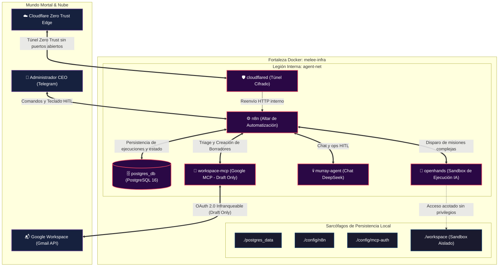

# 💀 Melee-Infra: El Averno de Automatización Ejecutiva ("1-Person CEO")

> *"¡Soy una fuerza demoníaca del averno! ¿Acaso creías que la infraestructura para orquestar un imperio corporativo de un solo hombre se mantendría en pie con scripts de pacotilla escritos por aspirantes a pirata? ¡Peleas como un granjero de vacas si pensabas que iba a tolerar un solo byte fuera de lugar! ¡Tiembla ante Murray!"*
> — **Murray, Demonic Sysadmin Supreme**

---

Bienvenido a **melee-infra**, la fortaleza de infraestructura como código diseñada para gobernar un sistema autónomo de **1-Person CEO** con control humano riguroso (*Human-In-The-Loop* - HITL).

Aquí no hay lugar para la desidia ni el código espagueti: cada servicio está aislado, cada puerto perimetral está sellado y cada tarea ejecutiva pasa bajo la supervisión despiadada del cráneo más temido del Caribe.

---

## 🏛️ Arquitectura del Inframundo



---

## ⚔️ Las Legiones del Cluster

Cada contenedor opera bajo el principio de menor privilegio dentro de la red privada `agent-net`:

| Servicio | Rol en el Averno | Justificación de Ingeniería |
| :--- | :--- | :--- |
| **`cloudflared`** | **La Barricada Perimetral** | Túnel seguro Zero Trust. Ni el mismísimo Largo LaGrande podrá cobrarte peajes ni escanear puertos: la máquina no expone ninguna IP pública ni abre puertos en tu router. |
| **`postgres_db`** | **El Sarcófago Transaccional** | PostgreSQL 16 Alpine respaldado por volumen persistente dedicado. Cero corrupción de datos; migraciones idempotentes y healthchecks nativos con `pg_isready`. |
| **`n8n`** | **El Orquestador Supremo** | Centro neurálgico conectado a Telegram. Si un mortal sin credenciales intenta enviar comandos, el filtro de `TELEGRAM_CHAT_ID` lo arroja al foso de los leones sin emitir respuesta. |
| **`workspace-mcp`** | **El Guardrail Infranqueable** | Servidor Model Context Protocol para Google Workspace. Por decreto demoníaco inmutable: `GMAIL_ALLOW_SENDING=false` y `GMAIL_ALLOW_DRAFTS=true`. La IA puede leer y redactar borradores, pero **el clic final de envío pertenece exclusivamente al dedo del CEO humano**. |
| **`murray-agent`** | **La Calavera en Telegram** | DeepSeek Chat en el mismo bot. Diagnóstico, ops HITL, clone/Q&A/git en `./workspace`, `/jobs` para la cola, `/triage` para el obrero. OpenHands es el obrero. Push, delete y heal de sandboxes piden Aprobar. Cero send de Gmail. |
| **`openhands`** | **El Coliseo de Ejecución Sandbox** | Entorno de desarrollo autónomo confinado en `./workspace` con `security_opt: ["no-new-privileges:true"]`. Impulsado por DeepSeek vía LiteLLM porque *"nunca debes pagar más de 20 pavos por un juego de ordenador"* (ni por un millón de tokens inflados). |

---

## 📜 Mapa de Documentación y Protocolos

La inteligencia de este repositorio está dividida con precisión quirúrgica:

1. **[architecture_spec.md](./architecture_spec.md) — Contratos vivos**: red, HTTP de `workspace-mcp` / `murray-agent`, HITL Telegram, guardrails y presupuesto RAM. Se actualiza cuando cambia un contrato.
2. **[HANDOFF.md](./HANDOFF.md) — Arranque para la próxima IA**: invariantes, trampas pagadas, dónde tocar. Cero secretos.
3. **[roadmap/](./roadmap/) — Hoja de ruta de implementación**:
   - [roadmap/README.md](./roadmap/README.md): Índice maestro y prompt de arranque para agentes de IA.
   - [roadmap/00_AGENT_PROTOCOL.md](./roadmap/00_AGENT_PROTOCOL.md): Reglas inquebrantables de determinismo, manejo de secretos y control de fallas (`BLOCKER.md`).
   - [roadmap/01_ENVIRONMENT_AND_NETWORKING.md](./roadmap/01_ENVIRONMENT_AND_NETWORKING.md): Fase 1 (Carpetas, `.env`, Postgres y Cloudflared).
   - [roadmap/02_N8N_AND_TELEGRAM_HITL.md](./roadmap/02_N8N_AND_TELEGRAM_HITL.md): Fase 2 (n8n, Telegram Router y validación de esquemas).
   - [roadmap/03_GOOGLE_WORKSPACE_MCP_GUARDRAILS.md](./roadmap/03_GOOGLE_WORKSPACE_MCP_GUARDRAILS.md): Fase 3 (MCP Google Workspace y workflow de triage).
   - [roadmap/04_OPENHANDS_RUNTIME_SANDBOX.md](./roadmap/04_OPENHANDS_RUNTIME_SANDBOX.md): Fase 4 (OpenHands Sandbox, DeepSeek LiteLLM y detección de bucles infinitos).
   - [roadmap/06_TELEGRAM_CODING_SESSIONS.md](./roadmap/06_TELEGRAM_CODING_SESSIONS.md): Fase 6 (clone/Q&A/misiones código por Telegram).
   - [roadmap/99_HUMAN_OPERATOR.md](./roadmap/99_HUMAN_OPERATOR.md): **Lo que tenés que hacer vos** (tokens, túnel, bot, OAuth). Click a click, sin decidir arquitectura.

4. **[.agents/](./.agents/) — Reglas y Habilidades Supremas**:
   - [.agents/rules/murray.md](./.agents/rules/murray.md): Directiva fundacional del Demonic Sysadmin Supreme.
   - [.agents/rules/estilo-comunicacion.md](./.agents/rules/estilo-comunicacion.md): Calibración cognitiva de alta densidad (formato sándwich, anti-dispersión, TDAH/TEA/AACC).
   - [.agents/skills/dev-protocol/](./.agents/skills/dev-protocol/): Skill estándar de ingeniería de software (deep modules, vertical slices, loop de debugging de 6 fases y ciclo de entrega git con gate humano).

---

## 🚀 Despliegue para Mortales (Instrucciones de Arranque)

Si tienes la audacia de operar esta maquinaria en tu terminal, sigue estos pasos sin temblar:

### 1. Clonar y Preparar Secretos
```bash
# Copiar el template de variables de entorno
cp .env.example .env

# Editar .env con tus tokens reales (Telegram, Cloudflare, DeepSeek, Postgres)
# ¡ADVERTENCIA: Si dejas contraseñas por defecto, tu alma sufrirá en el averno!
nano .env
```

### 2. Invocar a las Legiones de Docker
```bash
# Levantar el stack completo en segundo plano
docker compose up -d

# Inspeccionar el estado de los siervos
docker compose ps
```

### 2.1. Panel de Control y Observabilidad Integral (El Corazón de Murray)
Para operar, inspeccionar y monitorear todo el stack (Capas 1, 2 y 3) de manera interactiva y 100% self-hosted en tu consola:
```bash
./el_corazon_de_Murray.sh
```
Desde este panel interactivo podés:
- **Capa 1 (Agente)**: Ver la memoria viva del chat (`memory.json`), la sesión de código activa (`session.json`), la cola de jobs (`jobs.json`) y hacer ping/diagnóstico directo a Murray.
- **Capa 2 (Infraestructura)**: Monitorear el estado de salud (`healthy`/`sick`/`down`), seguir logs en vivo coloreados por servicio y vigilar el presupuesto de RAM (<4.5 GB).
- **Capa 3 (Workflows & Errores)**: Inspeccionar ejecuciones de n8n en Postgres y ejecutar el scanner automático de incidentes del RUNBOOK.
- **Mantenimiento**: Limpiezas quirúrgicas de repos, reinicio de memoria del agente, purga de sandboxes de OpenHands o reconstrucción total del stack.
- **Exportación para IA (Opción 14 / `--export-spec`)**: Emisión del blueprint y especificación técnica exhaustiva en inglés para recreación determinista del stack por otra IA.

### 3. Ejecutar la Suite de Pruebas End-to-End
```bash
# Validar que ningún servicio agonice en CrashLoopBackOff
bash tests/test_e2e_stack.sh
```

---

## 💼 Comercio y Licencias

> *"Vendo estas magníficas chaquetas de cuero..."*

Este repositorio se distribuye bajo la soberanía implacable de la infraestructura libre y autónoma. Úsalo con sabiduría mortal, o aténgase a la furia eterna de Murray.
