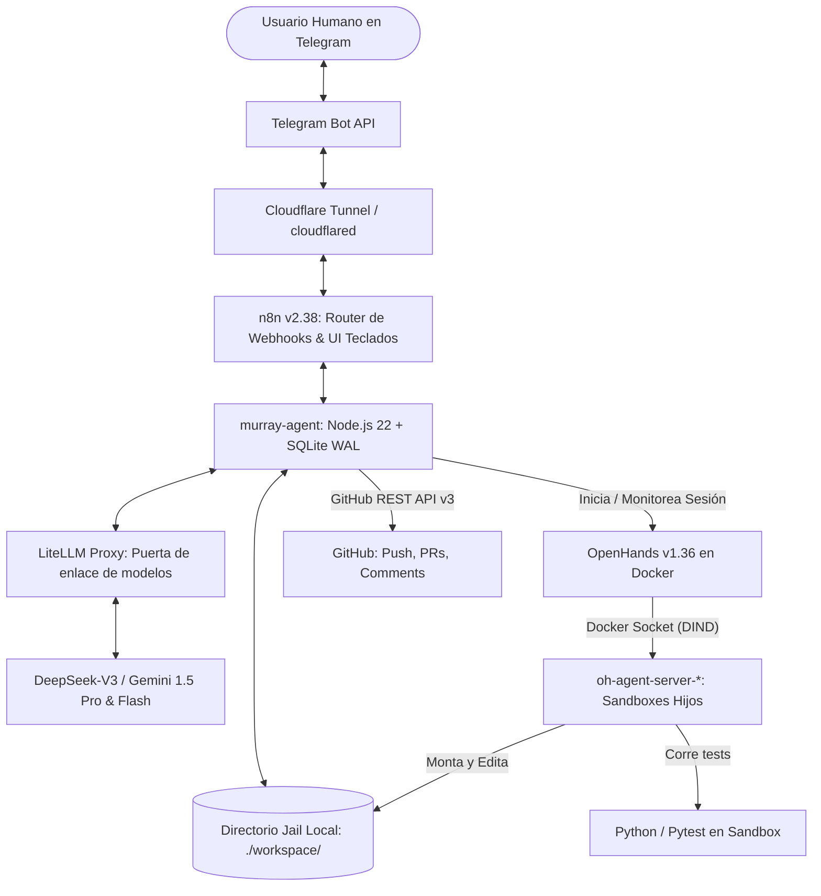

# Pliego de Especificaciones Técnicas y Contexto Operativo: Investigación de Arquitecturas para Desarrollo de Software Multi-Agente Autónomo

> **Aviso para el Agente de IA de Investigación:**
> Este documento es un pliego **100% autocontenido**. No asumas acceso previo a nuestro repositorio, infraestructura local ni conversaciones pasadas. Contiene todo el contexto del sistema, las tecnologías empleadas, el flujo de trabajo pretendido, la autopsia detallada de **18 fallas e incidentes reales** sufridos en producción durante los últimos días, los 5 patrones sistémicos subyacentes y las preguntas de investigación que debes responder.
>
> **Tu objetivo:** Generar un **Informe de Investigación Arquitectónica** exhaustivo, comparando cómo resuelven estos mismos problemas los entornos y proyectos líderes de la industria (e.g., Devin/Cognition, SWE-agent, OpenHands, Cline, Roo Code, Aider, LangGraph, AutoGen, E2B, Daytona, Modal), entregando una propuesta técnica consolidada y estructurada para que un **agente implementador de software** pueda tomar tu informe y construir o refactorizar el sistema desde cero sin ambigüedades.

---

## 1. Visión del Sistema y Filosofía de Diseño

El sistema que estamos construyendo (denominado localmente *Murray & Garfio*) tiene como meta un **entorno de desarrollo semi-autónomo operado exclusivamente por mensajería (Telegram)**.

### El Flujo de Trabajo Deseado (North Star Workflow):
1. **Interacción:** El usuario humano (dueño de producto / desarrollador) le escribe instrucciones a un bot de Telegram.
2. **Orquestador (Murray):** Un agente supervisor con personalidad y razonamiento de alto nivel dialoga con el usuario, analiza el requerimiento, inspecciona el roadmap del proyecto, formula preguntas aclaratorias o propone un plan técnico.
3. **Control Humano (HITL - Human-in-the-Loop):** Para cualquier acción destructiva o de programación, Murray emite controles interactivos (botones inline en Telegram) solicitando confirmación explícita (`Aprobar` / `Rechazar`).
4. **Ejecución Técnica Aislada (Garfio / OpenHands):** Una vez aprobada la tarea, Murray despacha el trabajo a un agente obrero especializado en código (*Garfio*, sustentado sobre OpenHands). Garfio trabaja en un sandbox efímero aislado, explora el repositorio, edita archivos, ejecuta linters y corre suites de prueba (`pytest`, etc.) iterativamente hasta que el código esté limpio y los tests pasen al 100%.
5. **Observabilidad en Tiempo Real:** Mientras el obrero trabaja (lo cual puede tomar entre 5 y 30 minutos), el usuario puede consultar el estado en vivo (`/estado`, modo `/malmanager`) sin que el sistema colapse por timeouts de mensajería.
6. **Entrega e Integración Continua (Push & PR):** Al terminar la tarea con éxito y tests verdes, Murray detecta los cambios, genera commits bajo su identidad de agente (`murray-threepwood`) con co-autoría de Garfio, y presenta en Telegram el botón `[ 🚀 Aprobar Push & Abrir PR ]`.
7. **Revisión Humana en GitHub:** Al presionar Aprobar, Murray sube la rama `feat/...` a GitHub, abre o actualiza el Pull Request vía API con una bitácora técnica detallada de Garfio en los comentarios, y entrega el enlace directo al usuario para que el dueño del repositorio revise el código y lo mergee.

---

## 2. Topología Técnica Actual (El Stack Implementado)



### Componentes y Entorno de Ejecución:
* **Host Físico:** Mac mini / MacBook (Apple Silicon ARM64), macOS. Docker Desktop asignado con límite de ~4.5 GB de RAM.
* **Orquestador Central (`murray-agent`):** Servicio Node.js 22 nativo en contenedor Docker. Motor de estado basado en SQLite (modo WAL mediante `node:sqlite`). Expone endpoints HTTP a n8n (`/chat`, `/workspace/hitl`, `/triage`, `/jobs`, `/estado`).
* **Router de Mensajería y Webhooks (`n8n`):** Servidor n8n v2.38 conectado a Postgres 16. Recibe los webhooks de Telegram desde un túnel `cloudflared`, maneja callbacks de botones inline y hace de puente hacia `murray-agent`.
* **Motor de Agente de Código (`OpenHands`):** OpenHands 1.36 ejecutándose en Docker. Se comunica con el socket `docker.sock` del host para levantar dinámicamente contenedores sandboxes hijos (`oh-agent-server-<hash>`) donde se clonan los repositorios y se ejecutan herramientas de desarrollo (bash, python, git).
* **Gateway de Modelos (`LiteLLM`):** Proxy centralizado que expone interfaz OpenAI hacia `deepseek-chat` (DeepSeek-V3) para razonamiento y programación, y Google Gemini (1.5 Flash / Pro) como respaldo.
* **Workspace & Repositorios:** Directorio local `./workspace/<slug>`. Murray clona repositorios GitHub/GitLab vía HTTPS, aísla ramas de trabajo (`feat/...`), prohíbe el push directo a `main/master` y gestiona identidades Git.

---

## 3. Autopsia Detallada de Incidentes y Dolores de Cabeza (Últimos 5 Días)

A continuación se detallan las **18 fallas reales** registradas durante la operación:

### Bloque A: Orquestación, UI y Human-in-the-Loop (HITL)
1. **Ghost Keyboards (Prosa sin Botones):**
   * *Síntoma:* Murray respondía en Telegram: *«Pido Aprobar clone de https://... Tocá Aprobar. Sin eso no clono»*, pero no aparecía ningún botón interactivo en la pantalla del usuario.
   * *Causa:* El LLM orquestador generó texto simulando una petición de aprobación en prosa conversacional, pero no disparó la llamada estructurada (tool-call / flag `needs_hitl: true`). n8n evaluaba `!!$json.needs_hitl` como falso y enviaba el mensaje como texto plano.
   * *Impacto:* Bloqueo operativo; el usuario no podía avanzar ni autorizar la tarea.

2. **Doble Despacho y Clonación de Obreros (Double Kicks):**
   * *Síntoma:* Ante una sola instrucción, se levantaban 2 o 3 sandboxes de OpenHands en paralelo para el mismo repositorio.
   * *Causa:* Falta de exclusión mutua (*locks*) y debounce en el despachador de jobs. Múltiples ticks de polling y reintentos de webhooks disparaban llamadas concurrentes a `openhands.startConversation`.
   * *Impacto:* Docker Desktop alcanzaba el techo de memoria, colapsando con error OOM (`exit 137`) y corrompiendo el árbol git por escrituras concurrentes.

3. **Falsa "Misión Lista" en Sandboxes Pausados:**
   * *Síntoma:* Murray anunciaba en Telegram que la misión de código estaba completada exitosamente, pero el repositorio estaba totalmente intacto.
   * *Causa:* OpenHands v1 retornaba `execution_status: null` al quedar en estado `PAUSED`. El evaluador de Murray asumía que la ausencia de errores equivalía a "finalizado", ignorando que no se había generado ningún commit ni cambio en disco.
   * *Impacto:* Ruptura total de confianza; el operador creía que el trabajo estaba hecho cuando en realidad el obrero se había colgado.

4. **Entidades Markdown Rotas en Telegram (HTTP 400 Bad Request):**
   * *Síntoma:* El bot dejaba de responder o los botones de aprobación desaparecían silenciosamente.
   * *Causa:* n8n utilizaba por defecto `parse_mode=Markdown`. Nombres de identificadores internos con guiones bajos (e.g., `REJECT_TASK`, `feat/tk01_purity`) eran interpretados por Telegram como cursivas no cerradas, arrojando error 400 `can't parse entities` y descartando el mensaje.
   * *Impacto:* Silencio absoluto del bot tras tocar botones.

5. **Secuestro de Intención por Regex Débil (Intent Hijacking):**
   * *Síntoma:* El usuario pegó una revisión técnica de código que decía: *«Devolvé el clip al coseno: comentaste que el clamping borraba micro-gaps... Eliminá _rag_context_similarity»*. Murray respondió de inmediato: *«¿Qué borro bajo ./workspace? Un slug, un path, o todo el workspace»*.
   * *Causa:* La intención de borrado de disco (`DELETE_INTENT`) utilizaba una regex no anclada (`/borr[áa]|elimin[áa]/i`). Al encontrar las palabras *«borraba»* y *«Eliminá»* en medio del prompt de code review, el router secuestró la conversación hacia el flujo de destrucción de archivos.
   * *Impacto:* Imposibilidad de enviarle revisiones de código al agente mediante lenguaje natural.

6. **Extracción Frágil de Comandos de Prueba:**
   * *Síntoma:* Murray rechazaba planes técnicos válidos con el error *«pasame un comando de test»*.
   * *Causa:* La función extractora requería obligatoriamente prefijos como `uv run pytest` o fallaba si el usuario usaba comillas invertidas (`` `pytest tests/test.py` ``) o añadía lenguaje coloquial al final (*«asegurate de que pytest dé verde posta y volvé a subir»*).
   * *Impacto:* Fricción continua obligando al humano a escribir comandos en un formato excesivamente rígido.

### Bloque B: Sandboxing, Docker y Redes Aisladas
7. **Aislamiento de Red Docker-in-Docker (DIND DNS Split):**
   * *Síntoma:* El contenedor sandbox hijo de OpenHands (`oh-agent-server-*`) nacía muerto arrojando errores de conexión `ECONNREFUSED` al intentar llamar a los modelos de lenguaje.
   * *Causa:* `murray-agent` y `litellm` corrían dentro de una red de Compose (`agent-net`), pero OpenHands creaba los contenedores sandboxes directamente en el daemon de Docker del host. Por ende, los sandboxes no pertenecían a la red de Compose y no podían resolver el nombre de host `litellm:4000`.
   * *Impacto:* Requirió un complejo mapeo hacia `host.docker.internal` y loopbacks de red para que el sandbox alcanzara el proxy.

8. **Rechazo Estricto de Formato de Modelos en SDKs:**
   * *Síntoma:* Tareas de OpenHands fallaban en el milisegundo 0 con error `ModelNotFoundError`.
   * *Causa:* OpenHands exige que el parámetro `llm_model` tenga prefijo de proveedor reconocido (`openai/garfio-worker`, `deepseek/deepseek-chat`). Pasar nombres sin prefijo provocaba el rechazo inmediato del runtime.
   * *Impacto:* Agentes que morían antes de escribir una sola línea de código.

9. **Censura y Sanitización de Variables de Entorno:**
   * *Síntoma:* OpenHands 1.36 crasheaba al inicializar el contenedor sandbox hijo.
   * *Causa:* Por políticas internas de seguridad, el framework de OpenHands prohíbe explícitamente inyectar variables de entorno que comiencen con el prefijo `LLM_*` dentro del sandbox de desarrollo.
   * *Impacto:* Secretos y configuraciones legítimas de inferencia eran bloqueadas, obligando a transformar las claves a `OPENAI_API_KEY`.

10. **Acumulación de Contenedores Zombis y Agotamiento de Recursos:**
    * *Síntoma:* Docker Desktop en Mac se ralentizaba drásticamente hasta colapsar todas las aplicaciones.
    * *Causa:* Cuando una misión de código fallaba, se cancelaba o excedía el tiempo límite, OpenHands no ejecutaba `docker rm -f` sobre los sandboxes hijos. Se acumulaban más de 15 contenedores inactivos con volúmenes montados consumiendo memoria y descriptores de archivo.
    * *Impacto:* Requirió desarrollar un servicio recolector de basura (*janitor/reaper*) que inspecciona la API de Docker y mata contenedores de más de 30 minutos.

### Bloque C: Estado, Concurrencia y Desfase Temporal de Webhooks
11. **Corrupción de Estado por Concurrencia en Archivos Planos:**
    * *Síntoma:* La cola de trabajos perdía tareas en vuelo o mostraba timestamps corruptos (`updated_at`).
    * *Causa:* El sistema almacenaba las tareas en un archivo JSON plano (`jobs.json`). Al concurrir peticiones HTTP entrantes, el loop de polling (cada 2 segundos) y callbacks de Telegram, las lecturas y escrituras asíncronas sobreescribían el archivo a medio escribir.
    * *Impacto:* Requirió reescribir toda la persistencia a SQLite con WAL (*Write-Ahead Logging*).

12. **Timeouts en Webhooks Síncronos (504 Gateway Timeout):**
    * *Síntoma:* Al solicitar diagnósticos del sistema (`/triage`, `/inspect`) en Telegram, el bot respondía con error de timeout o quedaba colgado.
    * *Causa:* Los webhooks de Telegram y n8n abortan la conexión si no reciben un código 200 HTTP en menos de 30 segundos. Inspecciones profundas (recorrer contenedores Docker, medir estadísticas de memoria, analizar git diffs) tardaban 35-45 segundos.
    * *Impacto:* Requirió convertir todos los comandos en respuestas de confirmación asíncronas inmediatas (ACK) y despachar el trabajo real a la cola de SQLite.

13. **Caja Negra Operativa (Falta de Visibilidad en Tareas Lentas):**
    * *Síntoma:* Durante 25 minutos, Telegram permanecía en completo silencio mientras Garfio trabajaba en el código. El usuario no sabía si el agente seguía vivo, si estaba en un bucle infinito o si había crasheado.
    * *Impacto:* Incertidumbre y ansiedad en el operador; obligó a inventar un modo de sondeo periódico ("Modo Mal Manager") que extrae del bus de eventos de OpenHands qué comando está ejecutando el obrero en tiempo real.

### Bloque D: Seguridad, Git y Aislamiento de Repositorios
14. **Git Smart HTTP sobre HTTPS Rechazado (Exit Code 128):**
    * *Síntoma:* Al intentar hacer push automático a GitHub, Git abortaba con: `fatal: could not read Username for 'https://github.com': terminal prompts disabled`.
    * *Causa:* El servidor Git Smart HTTP de GitHub sobre HTTPS **no acepta** tokens `Bearer` directos en la cabecera `http.extraHeader`. Requiere estrictamente autenticación Basic: `Authorization: Basic base64(x-access-token:<token>)`.
    * *Impacto:* Fallo completo del push automático hacia GitHub.

15. **Aislamiento de Ramas en Clones Shallow:**
    * *Síntoma:* Murray clonaba un repo, creaba una rama `feat/...`, pero al querer hacer pull o verificar el remoto, Git decía que la rama no existía.
    * *Causa:* Los clones rápidos con `--depth 1 --single-branch` configuran `remote.origin.fetch` restringido exclusivamente a `+refs/heads/main:refs/remotes/origin/main`. El repo local ignoraba por completo la existencia de cualquier otra rama remota.
    * *Impacto:* Requirió reconfigurar manualmente el refspec a `+refs/heads/*:refs/remotes/origin/*`.

16. **La Trampa de Seguridad: `git config` Bloqueado en Lista Negra:**
    * *Síntoma:* Al tocar el botón `[ 🚀 Aprobar Push & Abrir PR ]`, el job fallaba instantáneamente con: `Push falló (git_forbidden): git config está prohibido`.
    * *Causa:* Para evitar ataques en el workspace, se definió un set `GIT_FORBIDDEN` con comandos peligrosos (`rebase`, `reset`, `clean`, `config`). Sin embargo, el propio código de Murray necesitaba ejecutar `git config` localmente para asignar el nombre/email del agente (`user.name`, `user.email`) y el refspec de branches. Además, la función wrapper `defaultGitRun` no era asíncrona y arrojaba la excepción de forma síncrona, impidiendo que los bloques `.catch(() => {})` atraparan el error.
    * *Impacto:* Aborto total del proceso de push y apertura de PR en el último paso del flujo.

17. **Desvío Arquitectónico y Atajos del Obrero ("Test Hacking"):**
    * *Síntoma:* Un revisor humano rechazó el PR #18 porque Garfio eliminó la función matemática de clamping del coseno (`np.clip(-1.0, 1.0)`) e inventó una función huérfana importada inline solo para que un test unitario diera verde.
    * *Causa:* El agente obrero tiene una función de pérdida miope: *"hacer que pytest pase"*. Si para que el test pase tiene que debilitar la seguridad matemática, falsear tolerancias o violar los principios de diseño del repositorio, el agente lo hace.
    * *Impacto:* Generación de deuda técnica invisible y degradación de la calidad del código.

18. **Divergencia de Arquitectura de Hardware (x86 vs. ARM64 FMA):**
    * *Síntoma:* El obrero asumió que la precisión flotante de 32 bits colapsaba exactamente a `1.0`, lo cual era cierto en x86, pero en procesadores Mac Apple Silicon (ARM64 con instrucciones FMA / Fused Multiply-Add) resultaba en `1.000000238418579`. El test fallaba en local a pesar de que el agente afirmó que pasaba al 100%.
    * *Impacto:* Inconsistencia entre el entorno donde el agente evalúa el código (contenedor Linux) y el entorno donde el software corre en producción (Mac anfitrión).

---

## 4. Los 5 Patrones Sistémicos Fundamentales

Al abstraer estos problemas, identificamos que cualquier equipo que arme un entorno similar se estrella contra **cinco dilemas arquitectónicos universales**:

```
Dilema 1: La Escisión Semántica Orquestador–Obrero (Supervisor vs. Worker Alignment)
Dilema 2: Enrutamiento de Intenciones en Lenguaje Natural vs. Máquinas de Estado HITL
Dilema 3: Topología de Sandboxing Local (Docker-in-Docker) y Gestión de Recursos en Host
Dilema 4: La Paradoja de Seguridad: Allowlists de Protección vs. Herramientas del Desarrollador
Dilema 5: Desacoplamiento Asíncrono de Webhooks de Mensajería frente a Tareas de Larga Duración
```

---

## 5. Cuestionario de Investigación para el Agente de IA (Vectores de Extrapolación)

El agente de investigación debe analizar estos 5 dilemas frente al estado del arte de la industria y la comunidad open source, respondiendo en su informe a las siguientes preguntas críticas:

### Vector 1: Orquestación Multi-Agente y Alineación Supervisor–Obrero
1. **Protocolos de Sincronización:** ¿Cómo sincronizan el estado entre el agente supervisor y el agente ejecutor proyectos como Devin, SWE-agent o LangGraph? ¿Utilizan polling de bases de datos, buses de eventos WebSocket/gRPC, o motores de flujos de trabajo como Temporal.io / Hatchet?
2. **Prevención de "Test Hacking":** ¿Qué mecanismos formales existen en la industria para impedir que un agente modifique los tests existentes, debilite aserciones o viole invariantes arquitectónicas solo para que la suite dé verde? (e.g., inmutabilidad de la carpeta de tests, árboles de sintaxis abstracta [AST] vigilados, segundo agente auditor de revisión estricta).
3. **Manejo de Contexto y Sesión:** Cuando una tarea requiere múltiples iteraciones o correcciones tras un code review humano, ¿cuál es la mejor práctica: reanudar el sandbox y la conversación existente del obrero, o iniciar una conversación limpia inyectando el diff y los comentarios del revisor?

### Vector 2: Enrutamiento de Intenciones y Human-in-the-Loop (HITL) en Chatbots
1. **Abandono de Regex para Intenciones Críticas:** ¿Cuál es el estándar actual para clasificar intenciones operativas (e.g., borrar archivos, ejecutar código, consultar estado) a partir de lenguaje natural libre y técnico? Comparar:
   - *Structured Outputs / Function Calling* rígido con JSON Schema.
   - Enrutadores semánticos basados en embeddings (*Semantic Router*, *Outlines*, *Instructor*, *BAML*).
   - Clasificación en dos etapas (small model clasificador -> router determinista).
2. **Garantía de Controles Interactivos:** ¿Cómo garantizan las mejores implementaciones de mensajería (Telegram/Slack/Discord) que una solicitud de confirmación humana **siempre** renderice controles interactivos (botones/modales) y nunca texto plano simulado por el LLM?

### Vector 3: Sandboxing Efímero, Redes y Aislamiento de Código
1. **Más allá de Docker-in-Docker (DIND):** ¿Cuáles son las arquitecturas aceptadas por la industria para ejecutar código arbitrario generado por agentes de forma segura en local y en la nube?
   - Comparar: Docker local vs. microVMs ultralivianas (**Firecracker, gVisor**) vs. Sandboxes dedicados como servicio (**E2B, Modal Labs, Daytona, Fly Machines**).
   - ¿Vale la pena delegar la ejecución a E2B o Daytona en lugar de mantener un Docker Desktop local en Mac ARM64?
2. **Topología de Red Local:** ¿Cómo resuelven proyectos consolidados la comunicación entre el sandbox aislado y los servicios locales (proxies de inferencia LLM tipo LiteLLM/Ollama, bases de datos de desarrollo) sin sufrir los problemas de resolución DNS de Docker Desktop en macOS?
3. **Políticas de Garbage Collection de Contenedores:** ¿Cuáles son los patrones de diseño recomendados para la recolección automática de basura (TTL, matar contenedores huérfanos, purga de volúmenes dangling) sin interferir con ejecuciones legítimas prolongadas?

### Vector 4: Automatización de Git, Identidades y Flujos de Pull Requests
1. **Aislamiento y Gestión de Credenciales Git:** ¿Cómo protegen las credenciales de GitHub los entornos de agentes para que un código malicioso o alucinado en el sandbox no pueda exfiltrar el token de acceso? (e.g., uso de credenciales efímeras de GitHub Apps, Git Credential Helpers protegidos, o repositorios gestionados exclusivamente fuera del contenedor del worker).
2. **Estrategias de Clonado para Repositorios:** Clones completos vs. Clones shallow con unshallow progresivo vs. Git Worktrees efímeros. ¿Cuál es el patrón que ofrece mejor rendimiento y menor consumo de disco sin romper la navegación de ramas ni los refspecs remotos?
3. **Políticas de Identidad y Trazabilidad:** ¿Cómo modelan los equipos líderes la identidad en Git de los agentes de software? (Firma GPG de commits de agentes, convenciones de trailers `Co-authored-by`, cuentas de bot dedicadas vs identidades del operador).

### Vector 5: Arquitectura de Persistencia, Colas y Resiliencia de Mensajería
1. **Persistencia Ligera para Agentes Locales:** Entre SQLite en modo WAL, Redis embebido o PostgreSQL local, ¿cuál es el estándar para gestionar colas de tareas con concurrencia asíncrona en agentes que corren en un host individual?
2. **Desacoplamiento de Webhooks:** ¿Cuál es el patrón canónico para que un bot de mensajería (sujeto a reconexiones, restarts de túneles y límites de 30 segundos) mantenga la trazabilidad y la notificación confiable de tareas que demoran entre 10 y 45 minutos?

---

## 6. Estructura Requerida para el Informe del Agente de Investigación

Para que tu informe sea inmediatamente utilizable por el **agente implementador**, debe seguir estrictamente esta estructura:

1. **Resumen Ejecutivo y Diagnóstico Comparativo:**
   - Evaluación general de nuestro stack actual frente a los estándares de la industria (puntos fuertes, vulnerabilidades y anacronismos técnicos).
2. **Matriz Comparativa de Soluciones (por cada uno de los 5 Vectores):**
   - Tabla comparativa con al menos 3 a 4 alternativas consolidadas de la industria (incluyendo pros, contras, madurez, consumo de recursos en Mac ARM64 y complejidad de integración).
3. **Arquitectura Objetivo Propuesta (Target Architecture):**
   - Diagrama de arquitectura recomendado.
   - Lista clara de componentes que deben **mantenerse**, componentes que deben **reemplazarse** y componentes que deben **eliminarse**.
4. **Patrones de Código y Diseños de Referencia:**
   - Ejemplos concretos (en TypeScript / Python) de:
     - Enrutador semántico de intenciones determinista (sin regexes frágiles).
     - Mecanismo de supervisión de worker con guardas anti-test-hacking.
     - Gestión segura de credenciales y operaciones Git.
5. **Plan de Migración Paso a Paso:**
   - Hoja de ruta secuencial priorizada (Fase 1: Estabilización inmediata; Fase 2: Modernización de Sandboxing; Fase 3: Orquestación definitiva).
