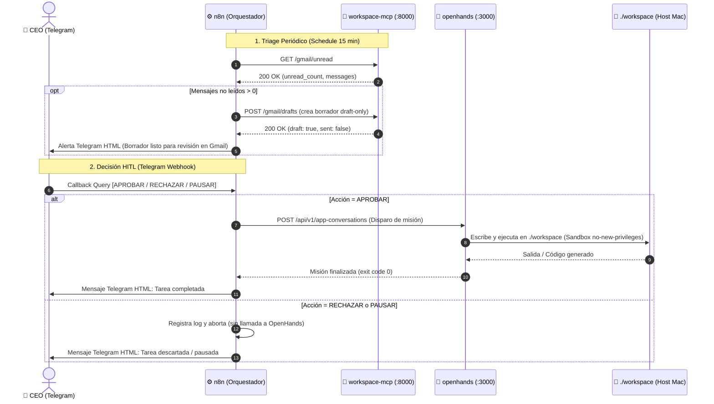

# Architecture Specification (`architecture_spec.md`) — Murray Infra

Este documento define la especificación de arquitectura viva, contratos de red, políticas de seguridad y límites de recursos para el sistema **1-Person CEO** (`murray-infra`). Cumple con la directiva de sincronización de contratos estipulada en [.agents/skills/dev-protocol/documentation.md](./.agents/skills/dev-protocol/documentation.md).

Si cambia un contrato HTTP, un workflow publicado, un guardrail o un presupuesto, este archivo se actualiza **en el mismo cambio**. No es un snapshot histórico: `CHANGELOG.md` guarda el relato.

---

## 1. Topología de Red y Perímetro (Zero Trust)

Todos los contenedores operan en la red interna tipo bridge `agent-net`. Ningún servicio expone puertos a `0.0.0.0` del host, salvo amarres exclusivos a loopback local (`127.0.0.1`) para auditoría y desarrollo.

```mermaid
flowchart TD
    subgraph Internet [Perímetro Externo]
        UserTelegram["Telegram API (Bot Client)"]
        CFEdge["Cloudflare Edge (Zero Trust)"]
        GmailCloud["Google Gmail API"]
    end

    subgraph Host [Docker Host: agent-net]
        CFDaemon["cloudflared (Tunnel Ingress)"]
        N8N["n8n (Orquestador :5678)"]
        Postgres["postgres_db (:5432)"]
        MCP["workspace-mcp (:8000)"]
        OpenHands["openhands (:3000)"]
    end

    CFEdge <==>|Túnel cifrado sin puertos entrantes| CFDaemon
    CFDaemon -->|HTTP: http://n8n:5678| N8N
    UserTelegram <==>|Webhook único vía CF| N8N
    N8N <==>|TCP 5432| Postgres
    N8N <==>|HTTP :8000| MCP
    N8N <==>|HTTP :3000| OpenHands
    MCP <==>|HTTPS OAuth 2.0 (Draft-Only)| GmailCloud
```

### Contratos de Red y Puertos

| Servicio | Nombre Docker DNS | Puerto Interno | Mapeo Host | Visibilidad |
| :--- | :--- | :--- | :--- | :--- |
| `cloudflared` | `cloudflared` | N/A (Outbound) | Ninguno | Red privada `agent-net`. Conexión de túnel saliente a Cloudflare. |
| `n8n` | `n8n` | `5678/tcp` | `127.0.0.1:${N8N_PORT:-5678}` | Loopback host para UI local; tráfico entrante público sólo vía `cloudflared`. Hostname público: `ceo.threepwood.uy` → `http://n8n:5678` (nunca `localhost` desde el túnel). |
| `postgres_db` | `postgres_db` | `5432/tcp` | Ninguno | Aislado en `agent-net`. Accesible únicamente por `n8n`. Imagen `postgres:16-alpine`. **No** subir a 17 sin OK humano (rompe el volumen). |
| `workspace-mcp`| `workspace-mcp` | `8000/tcp` | Ninguno | Aislado en `agent-net`. Accesible por `n8n`. HTTP Gmail API draft-only (`config/workspace-mcp/server.mjs`). |
| `openhands` | `openhands` | `3000/tcp` | `127.0.0.1:${OPENHANDS_PORT:-3000}` | Loopback host para UI local; invocado vía API interna. |

---

## 2. Invariantes de Seguridad y Políticas de Aislamiento

1. **HITL (Human-In-The-Loop) en Telegram**:
   - Todo update valida `chat.id` / `from.id` contra `$env.TELEGRAM_CHAT_ID`. IDs no autorizados: silencio total.
   - `$env.*` exige la variable en el servicio Compose `n8n` **y** `N8N_BLOCK_ENV_ACCESS_IN_NODE=false` (n8n 2.x).
   - Un bot = **un** webhook. El trigger canónico es `https://ceo.threepwood.uy/webhook/4dae132d-912c-40e0-b048-c00b42e03250/webhook` (`allowed_updates`: `message` + `callback_query`). La ruta `.../telegram trigger/webhook` da 404 en n8n 2.38.
   - Nodos Telegram send/notify: `additionalFields.parse_mode=HTML`. El default Markdown rompe `REJECT_TASK` (`_`).
   - **Aprobar** = `POST http://openhands:3000/api/v1/app-conversations`. **Rechazar/Pausar** no llaman a OpenHands. `POST /api/conversations` es la SPA (405).

2. **Guardrail *Draft-Only* en Google Workspace (`workspace-mcp`)**:
   - Variables inmutables: `GMAIL_ALLOW_SENDING=false` y `GMAIL_ALLOW_DRAFTS=true`.
   - Rutas de envío (`/gmail/send`, `/gmail/batch-send`, `/gmail/messages/send`) → `403` **antes** de tocar Gmail. No existe `send()` en `gmail-client.mjs`.
   - El envío final lo hace el operador en la UI de Gmail. Prohibido `GMAIL_ALLOW_SENDING=true`.

3. **Aislamiento del Runtime Sandbox (`openhands`)**:
   - `security_opt: ["no-new-privileges:true"]`.
   - Workspace host acotado a `./workspace`.
   - `MAX_ITERATIONS=30`.
   - Imagen: `ghcr.io/openhands/openhands:latest` (`docker.all-hands.dev` = NXDOMAIN).

4. **Zero Trust & Secretos**:
   - Secretos solo en `.env` y `config/mcp-auth/.gauth.json` (gitignore). Nunca en git ni en el chat.
   - OAuth Gmail: habilitar **Gmail API** (nunca “Gmail MCP API”). Cliente **Web** + Playground redirect `https://developers.google.com/oauthplayground`. Un `refresh_token` con `gmail.readonly` + `gmail.compose`.

### 2.1. Diagrama de Secuencia: Ciclo de Vida y Flujo HITL



---

## 3. Contratos de Interfaces y APIs

### 3.1. `workspace-mcp` (HTTP REST, Gmail API real)

Seam de prueba: `createGmailClient({ fetchImpl })` y `createWorkspaceMcpServer({ gmailClient })`. Los tests inyectan `fetch`; no pegan a Google. Producción usa `GOOGLE_CLIENT_ID`, `GOOGLE_CLIENT_SECRET`, `GOOGLE_REFRESH_TOKEN`.

Inbox vacía (`unread_count=0`, `status=ok`) **no** es stub. OAuth ausente es `503` `gmail_oauth_missing`, jamás un `unread_count=0` fingido.

- **`GET /healthz`**
  - `200`: `{"status":"ok","service":"workspace-mcp","gmail_allow_sending":false,"gmail_allow_drafts":true,"gmail_mode":"live"|"unconfigured"}`
- **`GET /gmail/unread`**
  - `200`: `{"status":"ok","unread_count":N,"messages":[{ "id","threadId","sender","subject","summary","senderHtml","subjectHtml","summaryHtml","date","inReplyTo" }]}`
  - `503`: `{"error":"gmail_oauth_missing"|"gmail_oauth_client_mismatch"|"gmail_oauth_failed","message":"..."}`
  - `502`: `{"error":"gmail_api_failed","message":"..."}`
  - Timeout saliente: 10s. Cap: 15 mensajes (`q=is:unread`).
- **`POST /gmail/drafts`**
  - Body (cualquiera alcanza): `{ "messageId"? , "threadId"? , "to"? , "subject"? , "replyBody"? , "body"? , "inReplyTo"? }`
    - `messageId` hidrata hilo/From/Subject vía `users.messages.get`.
    - `body` es alias de `replyBody`. Vacío → placeholder draft-only (no send).
  - `200`: `{"ok":true,"draft":true,"sent":false,"id":"<gmail draft id>","messageId":"...","threadId":"...","status":"created"}`
  - `403`: `GMAIL_ALLOW_DRAFTS=false`
  - `500` `guardrail_violation`: si `GMAIL_ALLOW_SENDING=true` (el proceso igual no envía)
- **Rutas send**: `403` `{"error":"gmail_send_blocked",...}` sin llamar al client.

### 3.2. `n8n` Workflows & Triggers

Import: `n8n import:workflow --input=... --projectId=RtVLhOyjbwQ3l5th` (no combinar `--userId` y `--projectId`). Después `n8n publish:workflow --id=...` y `docker compose restart n8n`. `--activeState=fromJson` no activa en este deploy.

- **Telegram HITL Router** (`workflows/telegram_hitl_router.json`, id publicado `20uYWal9fr2bWwVV`):
  - Trigger con `webhookId` `4dae132d-912c-40e0-b048-c00b42e03250`. Sin ese campo: 500 `reading 'node'`.
  - Credencial Telegram: nombre `Telegram account` (id vivo `9IhWvhoAHuzho5J5`).
- **Email Triage Draft** (`workflows/email_triage_draft.json`, id publicado `Z8f9K2mP1qRt5vWx`):
  - Schedule 15 min → `GET http://workspace-mcp:8000/gmail/unread` → IF `unread_count > 0` → split `messages` → dedup por `id` (static data) → `POST /gmail/drafts` → notify Telegram HTML.
  - **No** lleva `telegramTrigger` (no se puede robar el webhook del HITL).
  - **No** crea drafts en el schedule sin dedup (si no, cada 15 min duplica).
  - Misma credencial Telegram. El clic de envío sigue siendo Gmail, no el bot.

### 3.3. Proveedor LLM y Orquestación de Agentes

- **Proveedor**: DeepSeek vía LiteLLM (`deepseek/deepseek-chat`).
- **Base URL**: `https://api.deepseek.com/v1`.
- Tests de LLM: no llamar APIs vivas por default (mocks / fixtures).

---

## 4. Persistencia y Volúmenes

| Volumen / Ruta Host | Destino en Contenedor | Propósito |
| :--- | :--- | :--- |
| `postgres_data` (Docker Named Volume) | `/var/lib/postgresql/data` | Persistencia transaccional de `n8n`. Major 16; no migrar a 17 sin OK. |
| `n8n_data` (Docker Named Volume) | `/home/node/.n8n` | Claves criptográficas locales y configuraciones de `n8n`. |
| `./workflows` (Bind Mount, RO) | `/opt/workflows:ro` | JSON versionado. El mount **no** recarga flujos publicados. |
| `./config/workspace-mcp` (Bind Mount, RO) | `/opt/mcp:ro` | `server.mjs` + `gmail-client.mjs`. **`working_dir` del contenedor es `/tmp`**, no `/opt/mcp`: un cwd sobre bind `:ro` hace que Docker Desktop mate healthcheck/`compose exec` (`exit=-1`) aunque el proceso HTTP siga vivo. |
| `./config/mcp-auth` (Bind Mount) | `/app/auth` | `.gauth.json` OAuth (gitignore). |
| `./workspace` (Bind Mount) | `/opt/workspace_base` | Área aislada de `openhands`. |

---

## 5. Presupuesto de Recursos y Capacidad

- **Memoria RAM Total del Stack**: **< 4.5 GB** para los 5 contenedores. `docker stats` MemUsage es `12.5MiB / 3.8GiB`: parsear **solo el uso** (primer token). Medir con `docker compose stats`.
- **Monitoreo**: [tests/check_memory_budget.sh](./tests/check_memory_budget.sh).
- **Ejecuciones n8n**: `EXECUTIONS_DATA_PRUNE=true`, `EXECUTIONS_DATA_MAX_AGE=168`.
