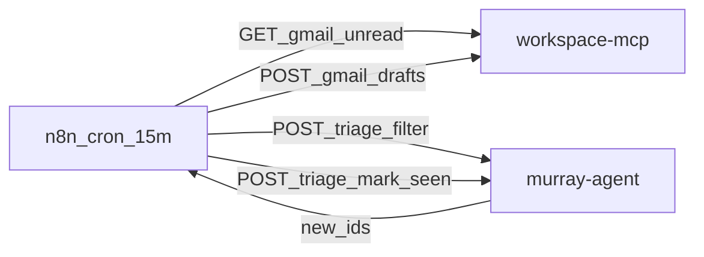

# 08. Fase 8: Memoria de correos en `murray.db`

`workspace-mcp` queda stateless. El cron de n8n pregunta a Murray qué IDs son nuevos, crea borradores, y marca vistos **después** de un draft 2xx.

**Precondición**: fase 07 al 100% (`seen_emails` ya existe).

## Prompt de arranque

```text
Leé roadmap/00_AGENT_PROTOCOL.md y SOLO roadmap/08_EMAIL_MEMORY_SEEN.md.
Implementá esta fase. No abras 09, 10, archive/ ni 90_BACKLOG_HARDENING.md.
No toques docker.sock ni proxies. No agregues SQLite en workspace-mcp.
No agregues litellm. Una tarea a la vez. Verificación + DoD. PROGRESS.md.
```

## Decisiones cerradas



- MCP solo habla con Gmail (leer + draft). Cero tabla de vistos.
- `seen_emails`: `(message_id TEXT PRIMARY KEY, thread_id TEXT, processed_at INTEGER)`. Sin `subject`. Sin cuerpos.
- Mark-seen **solo** si `POST /gmail/drafts` respondió 2xx. Si falla, el próximo cron reintenta.
- No migrar `staticData.seen` de n8n. El primer cron post-corte puede re-draftar unread actuales. Está aceptado.
- Workflow **mismo** `"id": "Z8f9K2mP1qRt5vWx"`. Si lo cambiás, n8n duplica el flujo.

## Fuera de alcance

- Schema nuevo (no `ALTER`). Si falta `seen_emails`, volvé a la fase 07; no la reimplementes acá.
- LiteLLM, `/model`, socket Docker, TTL de sandboxes.
- Scopes de Gmail, send, `GMAIL_ALLOW_SENDING`.
- Import/publish en n8n (eso es **H14** del humano).

## Archivos permitidos

- `config/murray-agent/server.mjs`
- `config/murray-agent/db.mjs` (helpers de seen; no cambies otras tablas)
- Módulo nuevo chico: `config/murray-agent/seen-emails.mjs`
- `config/murray-agent/llm.mjs` (alta de tool)
- `config/murray-agent/chat.mjs` (dispatch de la tool)
- `config/murray-agent/persona.md` (una línea: mails de hoy = ids, no asuntos)
- `workflows/email_triage_draft.json`
- `tests/test_seen_emails.mjs` (nuevo), `tests/test_murray_agent_http.mjs`, `tests/test_workspace_mcp_http.mjs` (solo si hace falta probar que MCP no ganó estado)
- Al cerrar 8.5: `architecture_spec.md`, `CONTEXT.md`, `lessons-learned.md`

---

## Tarea 8.1: `POST /triage/filter` y `POST /triage/mark-seen`

- **Objetivo**: HTTP de Murray para filtrar y marcar IDs. Sin asuntos.
- **Acciones Requeridas**:
  1. `POST /triage/filter`
     - Body: `{ "ids": ["m1", "m2"] }`
     - `ids` ausente o no-array → 400 `{ "error": "ids_required" }`
     - Respuesta 200: `{ "new_ids": ["m2"] }` — solo los que **no** están en `seen_emails`.
     - Conservá el orden de entrada. Dedup del array de input (un id dos veces cuenta una).
  2. `POST /triage/mark-seen`
     - Body: `{ "message_id": "m2", "thread_id": "t2" }`
     - `message_id` vacío → 400 `{ "error": "message_id_required" }`
     - `thread_id` puede ser `""`.
     - Upsert por `message_id`. `processed_at = Date.now()`.
     - Respuesta 200: `{ "status": "ok" }`
  3. GET no es obligatorio. La tool de 8.2 lee la DB en proceso.
- **Comando de Verificación**:
  ```bash
  node --test tests/test_seen_emails.mjs
  ```
- **DoD**: el archivo de test cubre: filter de vacío → todos nuevos; filter tras mark-seen → `new_ids` sin ese id; mark-seen dos veces → 200 y una sola row.

---

## Tarea 8.2: Tool `list_seen_emails`

- **Objetivo**: Murray responde “qué mails procesaste hoy” sin pasar por Gmail y **sin subjects**.
- **Acciones Requeridas**:
  1. Tool `list_seen_emails` en `llm.mjs`:
     - Descripción: `Mails ya procesados hoy (America/Montevideo). Devuelve count + message_id + processed_at. NUNCA asuntos ni remitentes.`
     - Params: `{}` (sin argumentos).
  2. Query: rows de `seen_emails` cuyo `processed_at` cae en el día civil de `America/Montevideo` (mismo TZ que `/jobs`).
  3. El reply puede listar ids y horas. Prohibido ir a `/gmail/unread` para esta pregunta.
  4. Intercept opcional: frases `qué mails procesaste hoy` / `mails de hoy` / `correos de hoy` pueden llamar la tool sin LLM. Si lo hacés, testealo. Si no, el LLM + tool alcanza.
- **Comando de Verificación**:
  ```bash
  node --test tests/test_seen_emails.mjs tests/test_murray_agent_http.mjs
  ```
- **DoD**: un test HTTP o de engine demuestra que la tool no incluye `subject` / `sender` en el payload.

---

## Tarea 8.3: Workflow `email_triage_draft.json`

- **Objetivo**: el cron de 15 min deja de usar `$getWorkflowStaticData`.
- **Acciones Requeridas**:
  1. Conservá `"id": "Z8f9K2mP1qRt5vWx"` y el nombre `email_triage_draft`.
  2. **Borrá** el nodo Code `Deduplicar Ya Vistos` (`dedup-seen-03c`) y cualquier `staticData.seen`.
  3. Grafo:
     1. Schedule 15 min (igual).
     2. `GET http://workspace-mcp:8000/gmail/unread` timeout 20s (igual).
     3. IF `unread_count > 0`.
     4. `POST http://murray-agent:8080/triage/filter` body JSON `{ "ids": <array de messages[].id> }`.
     5. Quedate solo con los `messages` cuyo `id` está en `new_ids`. Si `new_ids` vacío, cortá (no drafts).
     6. Split de esos messages.
     7. `POST http://workspace-mcp:8000/gmail/drafts` (mismo body que hoy: `messageId`, `threadId`, `to`, `subject`, `inReplyTo`).
     8. Solo en 2xx: `POST http://murray-agent:8080/triage/mark-seen` `{ "message_id": <id Gmail del unread>, "thread_id": <threadId> }`. El id es el del **mail**, no el del draft.
     9. Telegram HTML (igual). Sin `telegramTrigger`.
  4. Timeouts HTTP 20s. `parse_mode=HTML` en Telegram.
- **Comando de Verificación**:
  ```bash
  python3 - << 'PY'
  import json
  from pathlib import Path
  wf = json.loads(Path("workflows/email_triage_draft.json").read_text())
  assert wf["id"] == "Z8f9K2mP1qRt5vWx", wf["id"]
  blob = json.dumps(wf)
  assert "staticData" not in blob and "getWorkflowStaticData" not in blob
  assert "http://murray-agent:8080/triage/filter" in blob
  assert "http://murray-agent:8080/triage/mark-seen" in blob
  assert "http://workspace-mcp:8000/gmail/unread" in blob
  assert "http://workspace-mcp:8000/gmail/drafts" in blob
  assert "telegramTrigger" not in blob
  print("EMAIL_TRIAGE_SEEN_WORKFLOW_OK")
  PY
  ```
- **DoD**: stdout `EMAIL_TRIAGE_SEEN_WORKFLOW_OK`.

---

## Tarea 8.4: Tests

- **Objetivo**: MCP sigue sin estado de vistos; Murray es la memoria.
- **Acciones Requeridas**:
  1. Tests de 8.1 y 8.2 verdes.
  2. Confirmá que `config/workspace-mcp/` no ganó archivo de DB ni mapa de ids.
  3. No hace falta Gmail live para el DoD.
- **Comando de Verificación**:
  ```bash
  ! grep -R -n -E 'seen_emails|processedIds|staticData.seen' config/workspace-mcp && \
  node --test tests/test_seen_emails.mjs tests/test_murray_agent_http.mjs tests/test_workspace_mcp_http.mjs && \
  echo "EMAIL_MEMORY_TESTS_OK"
  ```
- **DoD**: stdout `EMAIL_MEMORY_TESTS_OK`.

---

## Tarea 8.5: Sync de docs

- **Objetivo**: el contrato deja de mandar dedup por static data.
- **Acciones Requeridas**:
  1. `architecture_spec.md`: flujo cron = unread → filter → drafts → mark-seen. MCP stateless.
  2. `CONTEXT.md`: término **seen_emails** (IDs procesados en `murray.db`).
  3. `lessons-learned.md`: reemplazá “el schedule deduplica por static data” por “Murray `/triage/filter` + `/triage/mark-seen`”.
  4. Recordá en `PROGRESS.md` que H14 (humano) importa el JSON. Sin H14 el cron viejo sigue duplicando.
- **Comando de Verificación**:
  ```bash
  ! grep -n 'static data' architecture_spec.md .agents/skills/dev-protocol/lessons-learned.md | grep -i -E 'dedup|deduplic' || true
  grep -q 'triage/filter' architecture_spec.md && echo "EMAIL_MEMORY_DOCS_OK"
  ```
- **DoD**: stdout `EMAIL_MEMORY_DOCS_OK`. `architecture_spec.md` describe el flujo nuevo.
