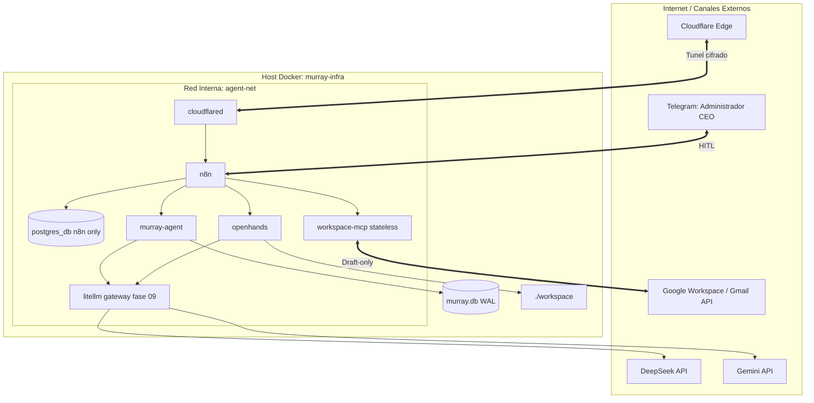

# Roadmap Maestro: Sistema de Automatización Ejecutiva ("1-Person CEO")

Este repositorio contiene la especificación de infraestructura, servicios y flujos de automatización para desplegar un entorno de "1-Person CEO" seguro, autónomo y con control humano (*Human-In-The-Loop* - HITL).

La documentación dentro de esta carpeta (`roadmap/`) está diseñada para que **agentes de IA autónomos** implementen **una fase viva a la vez**, sin rehacer el bootstrap ni tocar el endurecimiento del socket Docker.

Las fases 1–6 **ya están cumplidas**. Viven en [`archive/`](./archive/). No las ejecutes.

---

## 1. Arquitectura del Sistema (estado + destino 07–10)



El socket Docker de `murray-agent` y `openhands` **sigue montado como hoy**. No agregues proxies.

---

## 2. Mapa de fases

| Archivo | Fase | Qué es | Artefactos |
| :--- | :--- | :--- | :--- |
| [00_AGENT_PROTOCOL.md](./00_AGENT_PROTOCOL.md) | **Protocolo** | Reglas, secretos, fallas, `PROGRESS.md`. | `PROGRESS.md`, `BLOCKER.md` |
| [07_MURRAY_SQLITE_WAL.md](./07_MURRAY_SQLITE_WAL.md) | **Fase 7 (viva)** | `murray.db` WAL. Reemplaza JSON de jobs/memoria/sesión/HITL. | `config/murray-agent/db.mjs`, volumen `murray_agent_data` |
| [08_EMAIL_MEMORY_SEEN.md](./08_EMAIL_MEMORY_SEEN.md) | **Fase 8 (viva)** | Dedup de mails en `seen_emails`. MCP stateless. | `/triage/filter`, `/triage/mark-seen`, `email_triage_draft.json` |
| [09_LITELLM_GATEWAY.md](./09_LITELLM_GATEWAY.md) | **Fase 9 (viva)** | Contenedor LiteLLM. DeepSeek primario, Gemini fallback. | `config/litellm/`, servicio `litellm` |
| [10_SANDBOX_LIFECYCLE_TTL.md](./10_SANDBOX_LIFECYCLE_TTL.md) | **Fase 10 (viva)** | Hook al kick + watcher 30 min. Socket sin cambios. | `ops.mjs` allowlist `rm`, tests de reloj |
| [11_SELF_INSPECT.md](./11_SELF_INSPECT.md) | **Fase 11 (viva)** | Inspect async + auto-ops allowlist + `operator-inbox/`. | `inspect.mjs`, `operator_notes`, binds :ro de CHANGELOG/CONTEXT/91 |
| [90_BACKLOG_HARDENING.md](./90_BACKLOG_HARDENING.md) | **Backlog** | Paquete socket Docker (doble proxy + `VOLUMES=0` + `userns-remap`). **No ejecutar.** | — |
| [91_PERMISSIVE_WINDOW.md](./91_PERMISSIVE_WINDOW.md) | **Inventario** | Relajos 2026-09-19 para que Garfio labure. **No es fase viva.** Un agente de cyber los revierte. | LiteLLM loopback, HITL bypass code/clone, telegram quiet |
| [99_HUMAN_OPERATOR.md](./99_HUMAN_OPERATOR.md) | **Humano** | Clicks y keys. H13 Gemini + LiteLLM. H14 reimport triage. | `.env` |
| [archive/](./archive/) | **Histórico** | Fases 1–6 y el dictamen del arquitecto. **No ejecutar.** | — |

Dependencias: 08 y 09 y 10 requieren 07. 10 no requiere proxies.

---

## 3. Prompt de arranque (fases vivas)

Para que un agente haga **07–10 de punta a punta**, copiá el bloque de [`KICKOFF_07_10.md`](./KICKOFF_07_10.md).

Mini-prompt si solo vas a una fase:

```text
Sos un agente autónomo de ingeniería de software y DevOps en murray-infra.

Leé primero roadmap/00_AGENT_PROTOCOL.md y actualizá PROGRESS.md.

Implementá UNA sola fase viva, en este orden, y solo si la anterior está 100% DoD:
- roadmap/07_MURRAY_SQLITE_WAL.md
- roadmap/08_EMAIL_MEMORY_SEEN.md
- roadmap/09_LITELLM_GATEWAY.md
- roadmap/10_SANDBOX_LIFECYCLE_TTL.md
- roadmap/11_SELF_INSPECT.md

Prohibido:
- Re-ejecutar roadmap/archive/ (fases 1–6).
- Implementar roadmap/90_BACKLOG_HARDENING.md (socket proxy, userns-remap).
- Montar o desmontar /var/run/docker.sock. El socket sigue como está.
- Mover el estado de murray-agent a Postgres.
- Guardar mails vistos en workspace-mcp o en static data de n8n.

Una tarea a la vez. Verificación + DoD antes de avanzar. Si falla dos veces: BLOCKER.md y paro.
Secretos solo en .env. Actualizá .env.example con placeholders.
```
