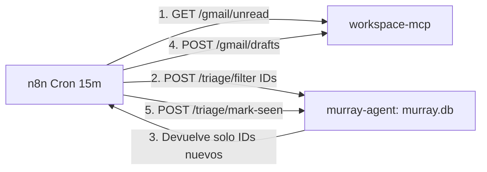

> **FUENTE DEL ARQUITECTO — NO EJECUTAR.**
> Este archivo guarda el dictamen del 2026-09-18. No es un prompt de implementación.
> El endurecimiento del socket Docker (Opción A, doble proxy, `VOLUMES=0`, `userns-remap`) está en `roadmap/90_BACKLOG_HARDENING.md` y **no** entra en la lista de ejecución.
> Ley vigente para programar: `roadmap/README.md` y las fases 07–10.

# Dictamen de arquitectura (2026-09-18)

Tablero técnico cerrado por el agente arquitecto. Las decisiones 2–5 se ejecutan en las fases 07–10. La decisión 1 (Docker socket) queda en backlog de hardenizado.

## Tablero de decisiones

1. **Docker Socket**: Opción A (`docker-socket-proxy`) con **doble proxy** (uno estricto para Murray, uno controlado para OpenHands). **No implementar ahora.**
2. **Persistencia**: SQLite con WAL mode (`murray.db`) desacoplado de Postgres. Fase 07.
3. **Emails**: memoria centralizada en `murray.db`, `workspace-mcp` 100% stateless. Fase 08.
4. **LLMs**: contenedor `litellm` como gateway con conmutación dinámica por comandos y fallback. Fase 09 (primario DeepSeek, fallback Gemini).
5. **Limpieza sandboxes**: lifecycle hook al inicio de cada job + TTL watcher interno a los 30 min. Fase 10.

---

## 1. Mitigaciones para Docker Socket (Opción A) — BACKLOG

Usar `tecnativa/docker-socket-proxy` reduce la superficie, pero si `openhands` tiene permiso de crear contenedores (`POST /containers/create`), todavía existe riesgo de que intente montar el disco del host.

Para blindarlo al máximo posible sin meterte en DinD, aplicá estas **tres capas de mitigación** (cuando el operador pida la etapa de hardenizado):

| Capa | Qué hace | Cómo mitiga el riesgo |
| :--- | :--- | :--- |
| **1. Doble Proxy (Segmentación)** | Dos instancias de proxy separadas en `agent-net`: `socket-proxy-murray` y `socket-proxy-openhands`. | `murray-agent` **no tiene permiso de crear contenedores** (`POST=0`, solo `RESTART=1`, `CONTAINERS=1`). Si comprometen al agente, no pueden spawnear nada en el host. |
| **2. Bloqueo de volúmenes en proxy** | En el proxy de OpenHands, setear `VOLUMES=0`. | Impide llamadas a la API `/volumes`. **No** strippea `HostConfig.Binds` en `POST /containers/create`. OpenHands necesita el bind de `./workspace`. |
| **3. User Namespace Remapping (`userns-remap`)** | Configuración nativa en `/etc/docker/daemon.json` del host. | El usuario `root` (UID 0) dentro del contenedor se mapea a un usuario sin privilegios en el host (ej: UID 100000). Si alguien logra escapar al sistema de archivos del host, no tiene privilegios de root real. En Docker Desktop macOS puede dejar inaccesibles volúmenes vivos. |

Sin DinD.

---

## 3. Deduplicación de correos en la memoria de Murray — FASE 08

En vez de una base aislada en `workspace-mcp`, centralizar toda la memoria en el SQLite único: **`murray.db`** (volumen `murray_agent_data`). Murray es el dueño del estado del sistema.

- **`workspace-mcp` queda stateless**: solo habla con la API de Google (lee y crea borradores). No guarda estado ni sabe qué mails ya se vieron.
- **`murray.db` concentra todas las tablas**:
  - `jobs`: cola y estado de ejecuciones.
  - `hitl_tokens`: tokens de 16 caracteres para Telegram con TTL.
  - `session_context`: historial de conversación y modelo activo.
  - `seen_emails`: `(message_id TEXT PRIMARY KEY, thread_id TEXT, processed_at DATETIME)`.

Murray puede responder por Telegram: *"¿qué mails procesaste hoy?"* consultando su SQLite local.
